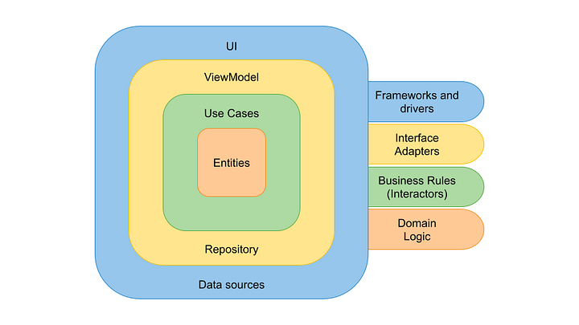

    
    <h1> Domain Driven Architecture Application Sample </h1>

This repository was created with the intention of providing developers with a
sample domain driven architecture app for projects using React-TypeScript.

By, `sample` it is meant `basic` or `starter` application
that could be used as a template for kicking-off a project, which can become
an enhanced version of this one driven by the future project's nature and what
it is conceived best for it. However, this sample is expected to be a guide to
perform knowledge sharing with other developers who don't know about this
software architecture.

## Contributing

We welcome contributions from the developer community! Whether it's reporting
bugs, suggesting improvements, or submitting pull requests, your input is
invaluable to the success of this project. Please refer to the ⁠`CONTRIBUTING.md`
file for guidelines on how to contribute.
